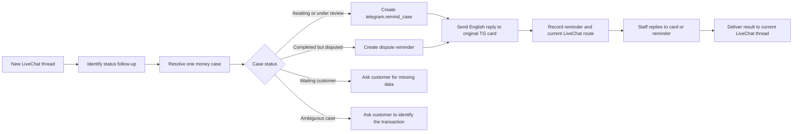

# Telegram 跨 Thread 资金案件再次询问设计

## 背景

存款未到账和提款未收到案件在资料收集完成后，会通过 `telegram.send_case_card` 转发到 Telegram 群。人工客服可能先回复“审核中”“查询中”或“处理中”，案件因而继续保持等待状态。客户离开 LiveChat 后再次打开会产生新的 thread；现有系统会继承上一 thread 的未完成工作流，但客户在新 thread 追问“怎么还没到”时，当前逻辑只向客户回复案件仍在确认中，不会重新提醒 Telegram 客服。

现有 `telegram.append_to_case` 只适合补充账号、订单号、截图等资料，而且当前发送实现会编辑原卡片。编辑旧消息不足以形成醒目的再次查询通知，也无法表达“客户已在新 thread 再次询问”。

## 目标

- 同时支持 `deposit_missing` 和 `withdrawal_missing`。
- 客户在新 LiveChat thread 首次追问同一笔未完成案件时，立即在 Telegram 群提醒人工客服。
- 同一个新 thread 对同一案件最多提醒一次。
- Telegram 提醒必须是纯英文新消息，并回复原案件卡片，而不是编辑原卡片。
- 客服回复原卡片或提醒消息时，结果都回写到当前承接该案件的 LiveChat thread。
- 正确区分审核中、等待客户、客服标记完成、客户确认完成和完成结果争议。
- 在客户同时催问并补充资料时，只产生一条完整的 Telegram 跟进消息。
- 多笔候选案件无法可靠区分时先向客户澄清，不提醒错误案件。

## 非目标

- 不设计跨多个新 thread 的频率上限、自动升级阈值或 SLA 系统。
- 不新增运营告警后台或人工案件管理界面。
- 不支持 Telegram topic 中未引用任何案件消息的自由文本自动归属。
- 不全面回填所有历史 Telegram 案件的标准状态。
- 不改变存款和提款 SOP 的首次资料收集要求。
- 不改变其他非资金类 Telegram SOP。

## 已有能力与缺口

`ConversationRepository._inherit_unfinished_thread_state()` 已会把上一 thread 的 `WAITING_EXTERNAL` 工作流、slot memory 和 `previous_thread_continuation` 继承给新的空白 thread。该能力可以作为跨 thread 连续性的第一信号。

`handle_waiting_backend()` 当前把没有补充资料的状态追问归类为 `waiting_followup`，生成客户安抚文本但不创建外部命令。只有识别出补充资料并且 slot memory 中存在 Telegram 案件标识时，才创建 `telegram.append_to_case`。

`TelegramSenderClient.append_to_case()` 当前调用 `editMessageText` 更新原卡片。新功能不得复用这个展示行为。

`TelegramCaseRepository` 已通过 `telegram_case_messages` 把原卡片、附件和人工回复消息映射到同一 `telegram_cases` 记录。新提醒消息也应加入这张映射表，使人工客服回复原卡片或提醒消息时都能找到同一案件。

`telegram_cases.status` 当前创建后基本保持 `created`。完成信息主要散落在 conversation slot memory 的 `telegram_case_resolved_at`、`last_telegram_staff_reply_type` 等字段中。新功能需要让案件表本身拥有可用于提醒前判断的标准状态。

## 产品规则

### 适用案件

只处理以下两个意图：

| SOP intent | 英文案件类型 |
| --- | --- |
| `deposit_missing` | `Deposit Not Credited` |
| `withdrawal_missing` | `Withdrawal Not Received` |

### 触发条件

普通跟进提醒必须同时满足：

1. 当前客户消息明确表达同一笔资金仍未到账、询问进度或要求再次查询。
2. 当前消息发生在与原案件不同的新 LiveChat thread。
3. 已可靠关联到一个 Telegram 资金案件。
4. 案件状态是 `awaiting_review` 或 `under_review`。
5. 当前新 thread 尚未对该案件创建过跟进提醒。

“好的”“谢谢”“知道了”等确认语、独立 FAQ、新问题和无法确认案件归属的消息不得触发提醒。

### 同一 Thread 只提醒一次

一次性约束的业务键为：

```text
tenant_id + telegram_case_id + source_thread_id
```

`follow_up_kind` 仍记录 `pending_follow_up` 或 `completion_dispute`，但不放入唯一键。同一个 thread 内无论状态后来如何变化，针对同一案件都只保留第一条外部提醒；后续消息继续向客户说明最新案件状态，但不再产生 Telegram 消息。

### 多笔案件关联

案件关联按以下顺序执行：

1. 当前消息提供的订单号或交易号与案件资料精确匹配。
2. 新 thread 从上一 thread 明确继承了有效的 Telegram 案件根消息标识。
3. 同一租户、同一 LiveChat chat 只有一笔符合类型和状态的候选资金案件。
4. 如果仍存在多笔候选，向客户询问存款或提款类型、订单号、金额或申请时间，不发送 Telegram 提醒。

账号、手机号和“最近更新的一笔”只能用于缩小候选范围，不能在仍有多笔候选时作为静默选中依据。

### 催问同时包含补充资料

如果同一条消息既是进度追问，又包含新的订单号、金额、截图或其他有效资料，系统创建一条 `telegram.remind_case`，而不是同时创建 `telegram.remind_case` 和 `telegram.append_to_case`。

提醒消息的 `Customer Update` 包含经过验证的英文摘要；新附件作为该提醒消息的回复发送。有效结构化资料仍合并到当前案件 slot memory，供后续判断和审计使用。原卡片不因这次提醒而被编辑。

## 案件状态

### 标准状态

`telegram_cases.status` 使用以下与本功能相关的状态：

| 状态 | 含义 | 普通提醒行为 |
| --- | --- | --- |
| `awaiting_review` | 已建立案件，尚无人工审核结论 | 允许提醒 |
| `under_review` | 人工明确表示审核中、查询中或处理中 | 允许提醒 |
| `waiting_customer` | 人工要求客户补充资料 | 不催客服，继续向客户索取资料 |
| `completed_by_staff` | 人工明确表示该笔交易已完成、已成功处理或已入账 | 不发送普通提醒 |
| `completed_confirmed_by_customer` | 客户确认资金已经收到 | 不再进入本案件跟进流程 |
| `completion_disputed` | 人工曾表示完成，但客户明确表示仍未收到 | 发送完成结果争议提醒 |
| `terminal_other` | 人工明确表示拒绝、取消、退回或其他终态结果 | 不作为审核中案件提醒 |

### 完成识别规则

LLM 不得单独决定案件是否完成。人工回复先由现有润色流程生成客户可见文本，同时由确定性状态分类器根据原始人工回复和案件类型生成案件状态。

进入 `completed_by_staff` 必须同时满足：

- 原始人工回复包含明确的完成、成功处理或入账信号；
- 信号与当前 `deposit_missing` 或 `withdrawal_missing` 类型一致，或者回复明确指向当前交易；
- 回复不包含审核中、等待、仍在处理等冲突信号。

无法可靠判断的人工更新不得默认当作完成。现有 `classify_staff_reply()` 对未知文本回落到 `resolution` 的行为不能直接作为案件完成依据。

客户随后明确表示已收到时，案件进入 `completed_confirmed_by_customer`。如果案件为 `completed_by_staff`，客户在新 thread 明确表示仍未到账，则进入 `completion_disputed`，并发送专用高优先级提醒。

人工回复消费事务必须同时更新 conversation state 和 `telegram_cases.status`。客户确认到账或对完成结果提出争议时，LiveChat 入站处理事务也必须通过案件仓储同步更新对应 Telegram 案件状态，避免两份状态长期分叉。

对于上线前已经存在且仍为 `created` 的案件，不进行全量历史回填。案件在首次被本功能读取时，根据最后一条原始 Telegram 人工回复和现有 slot memory 惰性归一化：存在 `telegram_case_resolved_at` 且原始回复通过明确完成校验时映射为 `completed_by_staff`；最近人工回复为等待类时映射为 `under_review`；没有人工回复时映射为 `awaiting_review`；无法确认时不得推断为完成。

## Telegram 展示

### 普通再次询问

所有标签、说明和 `Customer Update` 都必须是英文。不得把客户的中文、西班牙文或其他原文直接拼入消息。

```text
🔔 FOLLOW-UP REQUIRED

The customer has contacted us again in a new chat thread regarding the same case.

Case Type: {Deposit Not Credited | Withdrawal Not Received}
Follow-up: #{follow_up_number}
Previous Status: {Awaiting Review | Under Review}
Customer Update: {validated_english_summary}

Action Required:
{case_specific_action}

New Thread ID: {current_thread_id}
Follow-up Time: {timestamp}

Please reply directly to this message with the latest case status.
```

存款行动要求固定为：

```text
Please recheck whether the deposit has been credited and reply with the latest status.
```

提款行动要求固定为：

```text
Please recheck whether the withdrawal has been completed and reply with the latest status.
```

### 完成结果争议

存款：

```text
⚠️ CREDITING RESULT DISPUTED

The customer reports that the deposit is still not credited, although the previous case update marked it as completed.

Action Required:
Please verify the final transaction status and confirm the crediting reference or completion evidence.

Please reply directly to this message with the verification result.
```

提款：

```text
⚠️ COMPLETION DISPUTED

The customer reports that the withdrawal is still not received, although the previous case update marked it as completed.

Action Required:
Please verify the final transaction status and confirm the payment reference or completion evidence.

Please reply directly to this message with the verification result.
```

### Customer Update 生成

案件类型、跟进次数、之前状态和行动要求来自确定性数据或固定映射，不由 LLM生成。LLM只负责把当前客户消息翻译并压缩成一到两句英文 `Customer Update`。

生成约束：

- 只能表达客户明确提供的事实。
- 必须保留订单号、金额、日期和等待时长等关键值。
- 不得添加交易原因、处理状态、预计时间或完成结论。
- 不得输出非英文标签或客户原文。
- 输出不超过 300 个字符。

生成结果必须经过语言和关键事实校验。LLM 超时、异常、输出非英文、遗漏关键值或添加新事实时，使用固定英文回退：

```text
Deposit: The customer reports that the deposit has still not been credited.
Withdrawal: The customer reports that the withdrawal has still not been received.
```

LLM 失败不得阻止 Telegram 提醒发送，也不得影响案件匹配、状态判断、次数计算或幂等判断。

## 技术设计

### 命令契约

新增 `CommandType.TELEGRAM_REMIND_CASE = "telegram.remind_case"`。载荷包含：

- 已解析的内部 Telegram case ID；
- 原 Telegram chat、topic 和 root message ID；
- 原案件 intent；
- 当前 `conversation_id`、`chat_id` 和 `thread_id`；
- 当前客户原始消息；
- 已验证的结构化补充资料和附件 URL；
- `follow_up_kind`；
- 提醒创建时观察到的案件状态。

外部命令使用按案件和当前 thread 构造的稳定 `dedup_key`，不能使用当前 inbound event ID 或提醒类型作为唯一的一次性边界。这样同一 thread 的不同客户消息，以及同一 thread 内由普通催问转为完成结果争议的消息，都不会产生第二条提醒。

### 最小持久化变更

为保证跟进次数、发送状态和一次性约束可审计，新增轻量的 `telegram_case_followups` 记录：

- `telegram_case_id`
- `external_command_id`
- `source_conversation_id`
- `source_thread_id`
- `follow_up_kind`
- `follow_up_number`
- `customer_update_en`
- `previous_status`
- `telegram_message_id`
- `status`
- `created_at`
- `sent_at`

`source_thread_id` 必须非空。唯一键为 `(telegram_case_id, source_thread_id)`，并额外约束 `(telegram_case_id, follow_up_number)` 和 `external_command_id` 唯一。`follow_up_kind` 仅描述本 thread 首次提醒的类型。该表只服务于提醒幂等、次数和审计，不扩展为通用工单系统。

原案件卡片计为第 1 次联系，因此第一条跨 thread follow-up 的 `follow_up_number` 为 2。编号必须在锁定案件的事务内分配；重复命令和 worker 重试复用同一编号。

`telegram_cases` 增加当前回写目标：

- `current_conversation_id`
- `current_thread_id`

原有 `conversation_id` 和 `thread_id` 保留为案件最初来源。`status` 直接承载标准案件状态，不另建通用状态历史表。

### Worker 流程

`external_command_worker` 处理 `telegram.remind_case` 时：

1. 根据内部 case ID 和原 root message ID 读取并锁定案件。
2. 重新检查案件类型、标准状态和当前 thread 的唯一提醒记录。
3. 若状态已变化，根据最新状态取消普通提醒或切换为完成结果争议提醒。
4. 原子地保留 follow-up 记录、分配 `follow_up_number`，并把案件当前回写目标更新为新 conversation/thread。
5. 调用受约束的英文摘要服务；失败时使用固定英文回退。
6. 使用 `sendMessage` 回复原 `root_message_id`。不得调用 `editMessageText`。
7. 如有附件，先发送提醒文本，再把附件作为提醒消息的回复发送。
8. 将提醒消息和附件消息写入 `telegram_case_messages`，并将 follow-up 标记为已发送。
9. 产生 `telegram.case.reminded` 外部结果，供现有结果消费链路记录状态。

follow-up 发送状态依次为 `reserved`、`sending`、`sent`，另有 `delivery_uncertain` 和 `failed`。同一个 external command 的数据库重试必须复用已保留的 follow-up 记录和编号，不能增加次数或重复创建记录。

Telegram Bot API 不提供发送幂等键，因此“请求已被 Telegram 接收但本地未收到响应”的场景无法证明消息是否已经发送。为优先满足同一 thread 不重复提醒：明确的 429、建立连接前失败等确定未发送错误可以从 `reserved` 重试；请求发出后的超时、连接中断或结果不确定不得自动再次调用 `sendMessage`，而应标记 `delivery_uncertain`。这样不会为了追求重试而在 TG 群制造重复提醒。

### 人工回复回写

`TelegramCaseRepository.find_by_reply_message()` 仍通过 `telegram_case_messages` 解析案件，但返回 LiveChat 目标时优先使用 `telegram_cases.current_conversation_id/current_thread_id`，缺失时才回退到原始 conversation/thread。

人工客服回复以下任意消息都映射到同一案件：

- 原案件卡片；
- 原卡片附件；
- 任意 follow-up 提醒；
- follow-up 附件；
- 已登记的人工回复消息。

因此人工客服即使回复原卡片，客户结果也会进入当前承接案件的新 thread。

### 客户侧回复

正常再次查询使用客户当前语言表达“正在再次核实，有更新会在当前会话通知”，不得暴露 Telegram、case ID 或内部工作流名称。

完成结果争议使用客户当前语言表达“已收到仍未到账反馈，正在重新核实最终处理状态”。外部命令已可靠落库后即可生成该安全表述，不宣称人工客服已经回复或交易已经完成。

多笔案件无法确定时进入澄清，不创建提醒命令。`waiting_customer` 状态继续执行原有资料补充流程。

## 数据流



## 测试

### 案件识别

- 继承的单一未完成存款案件生成 `deposit_missing` 提醒。
- 继承的单一未完成提款案件生成 `withdrawal_missing` 提醒。
- 当前消息订单号精确匹配正确案件。
- 同时存在多笔候选且没有唯一标识时只澄清，不生成命令。
- acknowledgement、FAQ 和新问题不生成提醒。

### 幂等与次数

- 新 thread 首次催问立即创建提醒。
- 同一 thread 后续催问不创建第二条提醒。
- 同一个 inbound event 重放不重复提醒。
- worker 重试复用相同 follow-up 编号。
- Telegram 发送结果不确定时标记 `delivery_uncertain`，不自动发送第二条消息。
- 另一个新 thread 可以创建下一次提醒并递增编号。

### 状态

- `awaiting_review` 和 `under_review` 生成普通提醒。
- `waiting_customer` 不催客服。
- 明确完成回复进入 `completed_by_staff`。
- 未知人工回复不能默认进入完成状态。
- 客户确认到账进入 `completed_confirmed_by_customer`。
- `completed_by_staff` 后客户明确未收到，进入 `completion_disputed` 并生成争议模板。
- 已处于 `completion_disputed` 的案件在另一个尚未提醒过的新 thread 被再次追问时，继续使用争议模板。
- 同一 thread 已发送普通提醒后，即使状态转为完成争议，也不发送第二条 Telegram 提醒。
- 存款完成词不能错误关闭不相关的提款案件，反之亦然。

### Telegram 展示与路由

- 提醒调用 `sendMessage` 并回复原 root message。
- 提醒不调用 `editMessageText`。
- 普通存款、普通提款和两种完成争议模板均为纯英文。
- 人工回复原卡片或提醒消息都回写到当前新 thread。
- 催问同时带截图时只产生一条提醒，附件回复该提醒。

### LLM 安全

- 合法英文摘要保留客户明确提供的金额、订单号和等待时长。
- 非英文输出、遗漏关键值、添加不存在事实、超长输出、超时和异常均使用固定英文回退。
- LLM失败不阻止 Telegram 消息发送。

## 验收标准

- 存款或提款未到账客户在新 thread 首次追问时，Telegram 群立即收到一条回复原卡片的纯英文新消息。
- 同一案件、同一新 thread 最多发送一次，提醒类型变化也不能绕过该限制。
- 跟进次数来自持久化 follow-up 记录，不由 LLM推断。
- 之前状态来自标准案件状态，LLM不决定完成状态。
- `Customer Update` 可由 LLM翻译压缩，但任何失败都安全回退为固定英文。
- 多笔案件无法唯一确认时不会提醒错误卡片。
- 催问和补充资料在同一条 Telegram 提醒中合并。
- 客服标记完成后客户仍未收到时，发送完成结果争议提醒，而不是普通审核中提醒。
- 客服回复原卡片或提醒消息，结果均进入当前承接案件的新 LiveChat thread。

## 发布边界

首版只发布上述两个资金 SOP 和三个已确认边界：多笔案件识别、催问与补充资料合并、完成状态及争议识别。频率升级、运营告警、自由文本 Telegram 归属和全面历史回填保留为后续需求，不作为本次验收条件。
